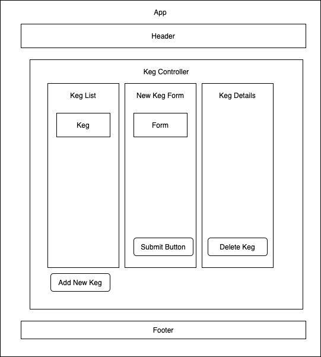

# _Tap Room Manager_
#### By _Matt Taylor_

### Epicodus independent project for React week 2

## Description
React application to create and manage an inventory of beer taps.

## Setup/Installation Requirements

* Open Terminal
* Type ``$ git clone https://github.com/mtaylorpdx/TapRoomManager``
* Open the project folder
* Type ``$ npm install``
* Type ``$ npm run start``

## Support and contact details

Email [@Matt Taylor](mailto:me@email.com)

## Technologies Used

* React
* Javascript
* Bootstrap
* Webpack
* Babel
* CSS

### License

*Licensed under the MIT License*

Copyright (c) 2020 **_Matt Taylor_**
