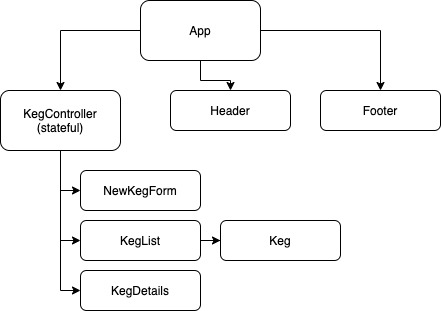

# _Tap Room Manager_
#### By _Matt Taylor_

### Epicodus independent project for React week 2

## Description
React application to create and manage an inventory of beer taps.

## User Stories
* As a user, I want to see a list/menu of all available kegs. 
* For each keg, I want to see its name, brand, price and alcoholContent (or perhaps something like flavor for a *As a user, I want to submit a form to add a new keg to a list.
* As a user, I want to be able to click on a keg to see its detail page.
* As a user, I want to see how many pints are left in a keg.
* As a user, I want to be able to click a button next to a keg whenever I sell a pint of it. This should decrease the number of pints left by 1. Pints should not be able to go below 0.

## Setup/Installation Requirements

* Open Terminal
* Type ``$ git clone https://github.com/mtaylorpdx/TapRoomManager``
* Open the project folder
* Type ``$ npm install``
* Type ``$ npm run start``

## Support and contact details

Email [@Matt Taylor](mailto:me@email.com)

## Technologies Used

* React
* Javascript
* Bootstrap
* Webpack
* Babel
* CSS

### License

*Licensed under the MIT License*

Copyright (c) 2020 **_Matt Taylor_**
